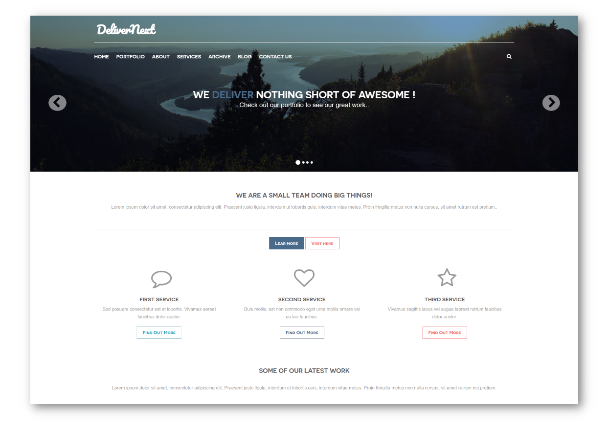

# DeliverNext Skeleton for Grav



DeliverNext skeleton is a port of the [Grav Deliver](https://github.com/getgrav/grav-theme-deliver) by [Grav Team](https://getgrav.org). Whether you’re a creative looking to show off your portfolio, or a business looking to promote your company, this theme is for you.

# Features

* Fully responsive
* Automatic and custom navigation menus included
* Showcase section with stunning animated slideshow module
* Services grid with custom FontAwesome icons
* Portfolio grid with modal window popup previews for portfolio item details. Both frontpage (minimal) and full featured versions included
* Footer section with custom menus, contact info, and more
* About layout with social icons module and custom styling
* Services layout with FontAwesome 4.7 icons and pricing tables
* Archive layout with blog posts archives list
* Full featured blog with support for custom authors and post dates via `translate-date` and `twig-extensions` plugins
* Contact us layout with Simple Form plugin support
* SEO optimization options (meta tags, open graph data)
* Multi-language support (English and Spanish translations included)
* Customizable alert boxes, button types/colors, and page title styles
* Back-to-top button and flexible page image configuration
* Automatic loading of `custom.css` and `custom.js` files
* SCSS files included for deeper customization options

## Basic Setup for a new Grav site

The simplest way to install DeliverNext theme for Grav is to download and install the DeliverNext Skeleton package:

1. [Download DeliverNext Skeleton](http://getgrav.org/downloads/skeletons#extras)
2. Simply unzip the package into your web root folder.
3. Point your browser at the folder, job done!

**TIP:** Check out the [general Grav installation instructions](http://learn.getgrav.org/basics/installation) for more details on this process.

---

## Existing Grav site

It is possible to install just the theme, but page content will need to reference the [DeliverNext theme](https://github.com/pmoreno-rodriguez/grav-theme-delivernext)'s supported templates.  It is strongly advised to at least install the DeliverNext Skeleton package to see the theme's capabilities in action.

To install  **just** the theme:

```
$ bin/gpm install delivernext
```